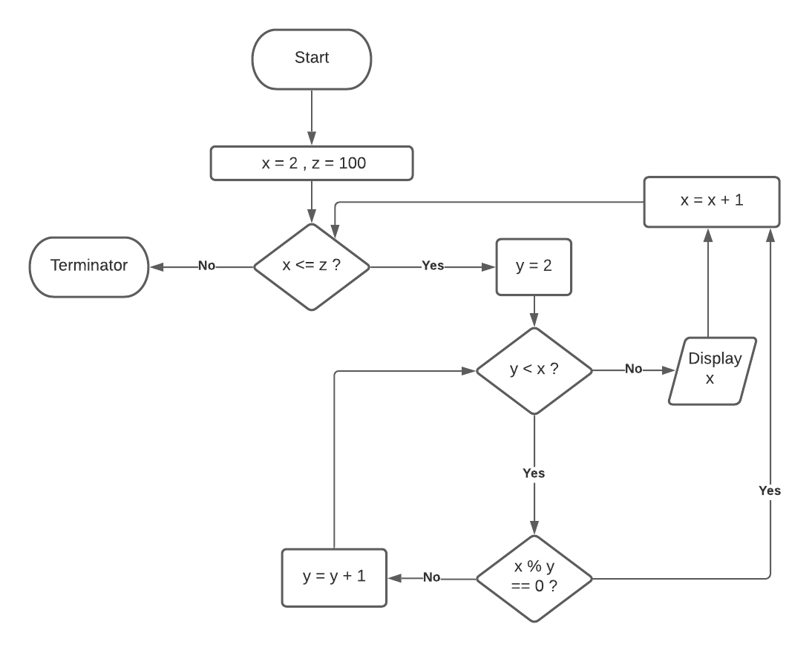

author: Lachlan Greve
- [Workbook - Term 2 - Assignment 1](#workbook---term-2---assignment-1)
	- [Question 1:](#question-1)
	- [Question 2](#question-2)
	- [Question 3](#question-3)
	- [Question 4](#question-4)
	- [Question 5:](#question-5)
	- [Question 6:](#question-6)
	- [Question 7](#question-7)
	- [Question 8](#question-8)
	- [Question 9](#question-9)
	- [Question 10](#question-10)
	- [Question 11](#question-11)
- [Bibliography](#bibliography)

# Workbook - Term 2 - Assignment 1

## Question 1:

Explain TWO approaches to control flow in Python. You must use code
snippets to support your answer.

---

A programs control flow is the order in which the program's source code is executed. All modern programming languages make use of three primary control flow types: sequential, selection and repetition. [^1]

1. Sequential Control:

Sequential control flow simply executes code in the order that it is written. In Python, as an interpreted languages, this is the default behavior.  The following code snippet is an example of sequential control flow in Python:[^2]

``` python
n = 5 # The variable n is set to the value 5.
print(f"{n} is five") # >>> "5 is five"
n = 3 # The variable n is set to the value 3.
print(f"{n} is three") # >>> "3 is three"
```

2. Selection Control:

Selection control flow represents a decision making process. These statements can add a lot of functionality to the code that we write by allowing us to write programs that interpret logic and conditionally respond to conditions.  

The structure of a Selection control flow consists of a conditional statement that can be evaluated as either True or False. The code that is executed next depends on the result the evaluation.

In Python an example of the selection control flow is the `if` statement. The below following code snippet is an example of selection control flow in Python:[^2]

``` python
n = 5
if n % 2 == 0:
   print(f"{n} is even")
else:
   print(f"{n} is odd")
```

In this example, the conditional statement is defined as `n % 2 == 0`. This statement will evaluate as `True` if the variable `n` is an even number, when this occurs the following indented code block, which states that the variable is even in output will be executed.

Use of the optional `else` keyword is also demonstrated in the above example. This allows us to define which code to be executed if the conditional statement is evaluated as `False`. Upon evaluation, as `n` is defined as the odd number five, the first code block following the conditional statement will be skipped and instead the code block contained within the `else` statement is executed.

## Question 2

*Explain the concept of type coercion in Python relating to strings, integers and floats.*

---

Type coercion is the automatic or implied conversion of objects from one data type to another. It is generally used when two variables of different data types are required to operate with each other.

Type *coercion* is an implicit change in object type whilst type *conversion* can be either implicit or explicit. Technically, the Python programming language does not support type coercion but is capable of implicit type conversion in situations that will not result in data loss.[^3]

For example: Python fully supports arithmetic calculations between 'mixed' numerical data types. When a binary arithmetic operator has operands of different numeric types, the operand with the 'narrower' type is 'widened' to that of the other.[^4]

This is demonstrated in the code snippet below:

``` python
x = 2 # x is of type 'int'
y = 5.5 # y is of type 'float'
z = x + y  # results in z = 5.5 (float)
```

Although int `x` and float `y` are added together without error, no type coercion occurs.

In order of execution, when python sees `x + y` it calls the `__add__` method on `x`, passing `y` :

    >>> x.__add__(y)
    NotImplemented

The result, `NotImplemented` occurs because Python can not add type `int` to type `float` without data loss. However, when Python receives the `NotImplemented` value it automatically reverses the expression with:

    >>> y.__radd__(x)
    5.5

Because the object of type float can operate with type int without data loss, the operation is completed. 

In other cases, such as `string` operations, Python is not able to manipulate objects of different data types that will result in data loss.

This is demonstrated in the following code snippet below:

``` python
x = 2 # x is of type 'int'
s = "Pizza" # s is of type 'string'
y = x + s # >>> "TypeError: can only concatenate str (not "int") to str"
```

Trying to add int `x` to type string `s` results in an error because they are of different data types. For the addition to succeed we need to first explicitly convert `x` to type string. [^5]

``` python
x = 2 # x is of type 'int'
s = "Pizza" # s is of type 'string'
y = str(x) + s # y = '2Pizza'
```

## Question 3

Explain the concept of pass by value in the Python programming language.

Provide a code snippet to illustrate your answer.

---

In Python `pass` is a `null` statement. This means that when it is called by the compiler no operation occurs. The `pass` statement is used to prevent an error when otherwise empty code is not allowed. Empty code is not allowed in loops, function definitions, class definitions or in conditional statements. [^6] 

The `pass` statement is commonly used as a placeholder during development, allowing the developer to scaffold the control flow and define the structure of the code that they plan to develop. The following code snippet is an example of how the `pass` statement is typically used. 

``` python
def Fun1():
    '''
    A placeholder function that will be used within the structure of control flow and completed at a later stage of development 
    '''
    pass
return

for val in range(1,10)
    pass

```

## Question 4

*Read the following scenario and answer the questions which follow:*

You have been asked to design an application that decodes obfuscated strings. The obfuscated messages come from a micro-service with a single endpoint which accepts a POST request containing a string with a message. The response returns an obfuscated string. You do not have access to the code that produces the string, but there are some API docs
that describe the obfuscation process:
```
1.  The string is converted to lower case and split into an array of strings using spaces to get separate words.

2.  Each word in the array that starts with a consonant followed by a vowel has ay added to the end of the word.

3.  Each word in the array that starts with TWO successive consonants, has the consonants moved to the end of the word and has _ay_ appended to the end of the word.

4.  Each word in the array that starts with a vowel has _way_ appended to the end of the word.

5.  The array is merged into a single string with spaces separating the words and is returned.
```

Define classes with class methods in Python, with docstrings to explain what they do, to deobfuscate a message from the service.

NOTE: you do not need to provide the implementation of the functions, or class methods, only the names of classes, methods and functions, and docstrings to explain what they do. However, you will need to provide arguments for the functions.

---

``` python
class Decoder:
    ''' A class to receive obfuscated messages, decode them and returns as deobfuscated message 
    
    Attributes: 
        message (string) : obfuscated message stored as a string  
    '''

    def __init__(self,message:str):
        ''' Constructs necessary attributes for the decoder object 
        
        Arguments:
            message (string) -- originally obfuscated message, referenced by class methods. 
        '''
    
    def split_msg(self):
        '''split self.message into an array of words, using space as a separator
        '''
    def join_msg(self):
        '''join self.message array, using space as a separator between words.
        '''
    def ay_scan(self):
        ''' check each word of self.message (array) to see if it ends in _ay_. If yes, remove _ay_ from the end of the word. Check if the last two letters are a consonant cluster. If yes, moves that consonant cluster to the start of the word  
        '''

    def way_scan(self):
        ''' check each word of self.message (array strings) to see if it ends in _way_. If yes, removes _way_ from that word.
        '''
    
    def desobs(self)->str:
        ''' Operator function that calls class functions: split_msg() -> way_scan() -> ay_scan -> join_msg() 

		Returns: 
			message (string) -- deobfuscated message as a string
        ''' 

```

## Question 5:

Analyse the code below and answer the questions which follow:

``` python
 def convert_celcius_to_fahrenheit
     ```Takes a celcius value and performs a calculation to convert celcius to farenheit and prints the result
     celsius = input()
     fahrenheit = (celsius * 9 / 5) + 32
     print("The result is: " + fahrenheit) 
     convert_celcius_to_fahrenheit()
     ```
```

a.  Identify the errors in the code that will be thrown on execution.

b.  Explain how to correct the code and implement error handling. You

---

The following errors occur on execution:

1.  SyntaxError: invalid syntax, line 1 --  This error is caused due to an error in the deceleration of the `convert_celcius_to_fahrenheit` function. The declaration is incorrectly indented with an additional space at the start of the line, it is also missing parenthesis and colon at the end of the declaration.
2.  SyntaxError: invalid syntax, line 2 -- This error is caused because the docstring syntax is incorrect. Docstring's should be using  defined using triple quotation marks, not triple backticks. The docstring for a simple function like this should begin and finish on the first line of the function.

No more errors will be thrown on execution, but the function will not operate as intended because the function has not been called properly.

``` python
def convert_celcius_to_fahrenheit():
    '''Takes a celcius value and performs a calculation to convert celcius to farenheit and prints the result'''
    celsius = None
    while not celsius:
        celsius = input("Enter a number in celcius to convert to Farenheight: ")
        try:
            celsius = float(celsius)
        except ValueError:
            print("That was not a valid data type.")
            celsius = None
    fahrenheit = (celsius * 9 / 5) + 32
    print(f"The result is:  + {fahrenheit}")
convert_celcius_to_fahrenheit())
```

A correctly function Python code snippet is included above. To correct the errors in the code the following changes were made:

1. Round bracket and colon added to function `convert_celcius_to_fahrenheit` definition.
2. Correct docstring syntax to start and finish with triple quotation marks and to complete on the first line of the function.
3. Add text "Enter a Value in celcius to convert to Fahrenheit: " to the input command -- Whilst not required for functionality, this improves usability of the code.
4. Convert `celsius` from string type received from input function to float.
5. Add an 'f' to the print statement to convert the string to an fstring that can correctly reference the calculated `farenheit` variable.
6. Unindent the call to the `convert_celcius_to_fahrenheit()` method so that it is called outside the definition of the method.

The code is now functional in its intended purpose, but has no error handling. In particular if a non numerical value is entered, a `ValueError` will be raised. To add error handling the following code was added:

1. Instantiate the celsius variable with the value of `None` at the start of the function.
2. Create a while loop that will continue to execute until a valid value of Celsius has been input.
3. Add a `try` block that attempts the conversion of the input Celsius value to a float data type.
4. Add a `except` block, which in the case a non-numerical value is input will inform the user that their input was invalid, and reset the value of `celsius` to none causing the while loop to repeat. 

## Question 6: 

Analyse the code below and answer the questions which follow:

 ``` python
 for number in range(1, 100):
     message = ''
     if number % 3 != 0:
     message =+ "Fizz"
     if number % 5 != 0:
     message =+ "Buzz"
     if number % 5 == 0 or number % 3 != 0:
     number =+ str(number)
     print(message)
```

The program should:
- print the word “Fizz” when number is a multiple of three 
- print the word “Buzz” when number is a multiple of five 
- print the word “FizzBuzz” when number is a multiple of both three and five

1.  Identify the errors in the code that will be thrown on execution.
2.  Explain how to correct the code so it functions according to the explanation. You may provide a code snippet to illustrate, but your answer must predominantly be a written explanation.

---
1. The following errors occur on execution:

Whitespace and indentation: 
    
- IndentationError: unexpected indent -- line 1: The for loop has an additional space at the start of line one, causing an indentation error on execution.

- IndentationError: expected an indented block -- line 4:  Code block inside if statement requires indentation. This is required on line 5,7 and 9. 

Type errors and syntax: 

- TypeError: bad operand type for unary +: 'str' -- line 4:  The correct syntax for the shorthand in place add operation `__iadd__` is '+=' not '=+'. All references of `=+` need to to be changed to `+=`. This is required on lines 4, 6 and 8. 

2. A functional code snippet inclusive of corrections is included below:

``` python
for number in range(1, 100):
     message = ''
     if number % 3 == 0:
     	message += "Fizz"
     if number % 5 == 0:
     	message += "Buzz"
     if number % 5 != 0 and number % 3 != 0:
     	message += str(number)
     print(message)
```

In addition to the changes outlined above, the following changes were made to make the code function according to the explanation:

1. If the number is a multiple of 3 or 5 the message should be be appended to print 'Fizz', 'Buzz' or both accordingly, Therefore `!=` is changed to `==` on line 3 and 4 - this will cause the code to respond if the number is a multiple of 3 or 5 as intended. 

2. The conditional statement on line 7 was changed from `if number % 5 == 0 or number % 3 != 0:` to `if number % 5 != 0 and number % 3 != 0:`. This will allow us to define how the program should respond when the number is NOT a multiple of three or five.  

3. Line 8 is changed from `number =+ str(number)` to `message += str(number)`. This will cause the program to print the current number, instead of an empty message. Whilst this functionality was not strictly a requirement, it helps to improve the useability of the code by displaying the current number.

## Question 7

Create a flowchart to illustrate the steps for listing all prime numbers between 1 and 100 (inclusive). Your flowchart should make use of standard conventions for flowcharts to indicate processes, tasks, actions, or operations, and should include accurate pseudocode for each step.

---



```
variable int: X # lower limit range of numbers to check for prime numbers
variable int: Z # upper limit range of numbers to check for prime numbers
variable int: Y # inner loop variable to check factors of X

# Set up the initial state of variables

X = 2 # lower limit of numbers of interest
Z = 100 # upper limit of numbers of interest
Y = 2 # starting number to check for prime factors

for Z greater than or equal to X :
    Y = 2
    for X greater than Y:
        if the modulus of X to Y is equal to 0: # if true the number is not prime because Y is a factor of X
            X = X + 1 # this number is not a prime so increase the number and move to the next
            STOP for loop # any remaining calculations are not important because this number is not prime
        else: # Y is not a factor of X
            Y = Y + 1 # keep checking if there are any factors of Y in X.  
    print X # if the for loops completes all iterations without terminating then X is a prime. display this in output.
    X = X + 1 # increase x until it is equal to Z
```

Pseudocode and flowchart have been included above.

The code outlined above utilises two nested loops to display all of the prime numbers in a given range. The first loop will iterate between all numbers from the lower range to upper range. The second loop will check each number to see if it is a prime.

Primes are checked if the number is evenly divisible by any numbers between the lower range up to the current inner loop number (variable `Y`). If the number is prime it is displayed in output, if a factor is found, the outer loop variable `X` is increased by 1.

## Question 8

Explain the approach of TWO sorting algorithms and identify how each of these approaches is reflected by its Big O efficiency.

---

1. Merge Sort

Merge Sort is a 'Divide and Conquer' algorithm. These types of algorithms divide a larger problem (such as sorting a whole array) into smaller sub-problems (such as sorting a sub-array), when a solution to all sub-problems has been found the results are combined and used to solve the main problem. [^7]

In the Merge Sort algorithm; an unsorted array with `n` elements is divided into `n` sub arrays, each with a single element. Because a single element is always sorted on its own, these sub-arrays are then merged to produce new sorted sub arrays, positioning the smallest element to the left and the largest element to the right. This procedure is repeated until a complete sorted array of length `n` is produced. [^8]

As the array is divided into half in each step of the calculation, the time complexity is proportionate to the maximum height of the binary tree, which is known to be of the order `logn`. Furthermore, to merge the arrays an additional calculation procedure is required across all elements of the array, which is of the order `n`. Combining the two steps of the Merge Sort algorithm it is apparent that the Big O efficiency is equal to `O(nlogn)`. In terms of space complexity it should be considered that the Merge Sort algorithm creates a copy of the entire array being sorted, taking up `O(n)` space- this means that the algorithm does not work in place and requires additional space, equivalent to the size of the original array for computation. [^8]

Merge Sort is a relatively efficient sorting algorithm which is generally used for large datasets because its big O efficiency scales well with the size of the problem. Merge sort is a reliable algorithm that completes its sorting in with complexity of `O(nlogn)` in all cases, this means that the algorithm does not consider if the initial array is sorted or not - it will always take the same amount of time to preform the sort.

2. Insertion Sort: 

The Insertion Sort algorithm works by separating an array into sorted (to the left) and unsorted parts (to the right). A `key` element is selected as the first element of an array. This element  will be iteratively compared to other elements of the array. At each iteration a determination is made to see if the `key` is smaller or larger than the element it is being compared to. If the `key` is smaller than the element it is being compared to, the `key` element swaps position with the compared element in the array and the `key` is compared to the next element to the left. In each iteration, we extend the sorted sub-array, whilst shrinking the unsorted sub-array. This process is repeated until the `key` elements position in the sorted array is found. Then, a new key element is selected from the element to the right of the original position of the `key` element. This process is repeated until the entire array has been sorted. [^9]

The algorithm consists of two loops: an outer loop to pick items and an inner loop to iterate through the array. The mechanism of this algorithm is frequently compared to the real world example of the way we sort a hand of playing playing cards. In the worst case scenario - when the input array is reverse sorted, both loops of the algorithm will need to iterate across all elements of the array, for every element of the array. In this case, it is apparent that the algorithm has a Big O efficiency of `O(n^2)`. However, in the best case situation (when the input array is already sorted) the Insertion Sort algorithm has big O efficiency of `Ω(n)` - the loop will only pass each element of the array once to confirm that it is in the correct position. In terms of space complexity the Insertion Sort algorithm works in place, it requires only a single additional memory unit for computation and have has big O space efficiency of O(1). [^10]

Insertion sort is a simple sorting algorithm that is efficient for small or sorted data sets but is inefficient for sorting larger data. Also, Insertion Sort is adaptive, if the input array is already partially sorted the total number of steps that are required is reduced. This makes the Insertion Sort algorithm useful for sorting live streams of data where the position of new data needs to be inserted into an array of previously sorted data. 

## Question 9 

Compare TWO sorting algorithms by efficiency.

---

|                           | Merge Sort | Insertion Sort  |
|---------------------------|------------|-----------------|
| Time Complexity (Worst)   |O(n log(n)) |O(n^2)	       |
| Time Complexity (Average) | Θ(n log(n))|Θ(n^2)	       |
| Time Complexity (Best)    | Ω(n log(n))|Ω(n)	           |
| Space Complexity (Worst)  |  O(n)      |O(1)             |
Table 1: Comparison of Big O Complexity for Merge Sort & Insertion Sort [^11]

A sorting algorithm is used to arrange data in a given array according to a specified comparison operator. Different sorting algorithm may reach the same outcome but the approach to reach this outcome as defined by the sorting algorithm can result in different levels of performance.

In computer science "Big O efficiency" is generally used to describe the upper bound time performance of an algorithm. Big O efficiency is usually used to compare the worst case time complexity performance of different sorting algorithms. The worst case is used as a benchmark because it provides certainty regarding the lower of band of performance that can be expect from the algorithm. However, when comparing two different algorithms it is important to consider other factors such as the average case, best case and space complexity, this information will help you to select the appropriate algorithm for the specific requirements of a problem. 

Big O efficency values for *Merge Sort* and *Insertion Sort* have been tabled above. We can see that *Merge Sort* has better Big O performance (in the worst case) with Big O of `O(nlog(n))`. *Merge Sort* has the same time complexity for best case and average case and worst case situations. From this it can be understood that the algorithm is not responsive to the input array, regardless of order of the data in the input array the algorithm will use the same procedure. The *Insertion Sort* alogorithm has worst and average case time complexity of `O(n^2)`, in the best case (when the input array is already sorted) *Instertion Sort* has Big O of `Ω(n)`. From these results, we understand that in most cases the *Merge Sort* algorithm will result in better performance - however in some situations such as the the input data is already sorted or when the number of element in the array is small *Insertion Sort* may yield better performance. [^11]

In terms of space complexity *Merge Sort* has Big O of `O(n)` whilst *Insertion Sort* has a Big O `O(1)`. The *Merge Sort* algorithm is out of place, which means that takes up additional space, equivalent to the space of the original input array to preform its calculation. Whereas *Insertion Sort* is an in place algorithm, it requires only a very small amount of additional space that is constant in regard to the size of the array for computation.

From this analysis it is apparent that in the worst case situation, *Merge Sort* is a more time efficencent sorting algorithm then the *Insertion Sort* algorithm and *Insertion Sort* is a more efficient algorithm in terms of space complexity.  The differences in the approach of both of these algorithms means that there are different applications where you would choose either algorithm over the other. In general - *Merge Sort* is an efficient and reliable algorithm that is suitable for use with large datasets or when reliable performance is a requirement. On the other hand, *Insertion Sort* is a simple algorithm that is suitable for small datasets or datasets that are already sorted.

## Question 10

Write pseudocode for the following problem:

You have access to two variables: raining (boolean) and temperature (integer). If it’s raining and the temperature is less than 15 degrees, print to the screen “It’s wet and cold”, if it is less than 15 but not raining print “It’s not raining but cold”. If it’s greater than or equal to 15 but not raining print “It’s warm but not raining”, and otherwise tell them “It’s warm and raining”. 

---

``` source-code
variable boolean: RAINING 
variable int: TEMPERATURE

if RAINING is equal to True:
    if TEMPERATURE is less than 15:
        print "It's wet and cold" 
    else:
        print "Its warm and raining"
if RAINING is equal to False:
    if TEMPERATURE is less than 15:
        print "It's not raining but cold"
    else:
        print "It's warm but not raining"

```

## Question 11 

Create Python code to provide a solution to the following scenario. You must comment your code/provide docstrings.
```
Once upon a time there was a series of 5 books about a young wizard. Children all over the world think they are fantastic!

To increase sales, the publisher created a pricing model to take advantage of the wizard's extreme popularity.

The pricing model has the following rules:

* a single copy of any of the five books costs 8 EUR
* a 5% discount is applied if two different books from the series are purchased
* a 10% discount is applied if three different books from the series are purchased
* a 20% discount is applied if four different books from the series are purchased
* a 25% discount is applied if all five books from the series are purchased
* if the customer purchases two copies of one book, the second copy will cost 8 EUR and will not have any discount applied unless there are more duplicated of another book that could have a discount applied as part of a second set of books.

Wizard Fever is sweeping the country and parents of children everywhere are queuing up with shopping baskets overflowing with the wizard books.

A simple case of this would be:

customerShoppingCart([book1, book2, book3]) => $21.60

A more complex case using the pricing model is:

customerShoppingCart([book1, book2, book3, book4, book5, book1, book3, book5]) => $51.60

**Develop an algorithm to calculate the total price of any possible combination of purchases which provides a discount according to the pricing model above.
```

---

A functional code snippet is included below. The algorithm uses two functions to calculate the correct price. `group(cart)` is a generator function that takes a given list of books and yields the largest possible set of unique books [^13]. On resuming execution, books that were included in the previous set are 'removed' from the shopping cart and the next largest possible set of unique books is yielded. 

`customerShoppingCart(cart)` for a given list of books in the shopping cart will calculate the total price, inclusive of applied discounts. The function calculates the cost of the set based on the size of the set yielded by a call to `group(cart)`. Additionally, the edge case when two sets of four are cheaper than one set of 5 and one set of three has been addressed in a conditional `if` statement. [^14]

``` python
cost = (0, 8.00, 15.20, 21.60, 25.60, 30.00) #Each set of books has a fixed fixed price based on the size of the set.

book1 = "Harry Potter and the Sorcerer's Stone"
book2 = "Harry Potter and the Chamber of Secrets"
book3 = "Harry Potter and the Prisoner of Azkaban"
book4 = "Harry Potter and the Goblet of Fire"
book5 = "Harry Potter and the Order of the Phoenix"

def group(cart:list):
    """ A generator function to seperate a shopping cart list of items into maximum sized unique groups
    Args:
        cart (list[str]): A list of all books included in the shopping cart.

    Yields:
        Generator[set,None,None]: Largest set possible out of books remaining in shopping cart.
    """
    books = cart.copy()
    while len(books) > 0:
        sets = set(books) # form a set out of all books remaining in the shopping card, will result in the largest sized 
        yield sets # upon execution the function returns the largest possible set out of remaining books
        for book in sets:
            books.remove(book) # upon resuming execution all books included in the previous set are removed from the shopping cart.
def customerShoppingCart(cart:list[str])->float:
    """ A function to calculate the total price for a shopping cart of books 

    Args:
        cart (list[str]): A list of all books included in the shopping cart. 

    Returns:
        float: The calculated total cost inclusive of applied discounts. 
    """
    price = sum(cost[len(sets)] for sets in group(cart)) # the price of a set of books is determined by its size
    if len(cart) % 8 == 0 and len(set(cart)) == 5:
        # this conditional statement addresses the edge case when two sets of 4 is cheaper than the combination of one set of 5 and one set of 3.
		# the customer will only be charged the lowest possible price.
        price -= 0.05 * len(cart) # 2 set of 4 books is 0.05 euro/book cheaper than 1 set of 5 books and 1 set of 3 books.
    return round(price,2)

print(customerShoppingCart([book1, book2, book3])) # Price = 21.60 
print(customerShoppingCart([book1, book1, book1, book1, book1, book1, book1, book1])) # Price = 51.20 Note: This is the correct answer not 51.60 as per the description.
print(customerShoppingCart([book1, book1, book2, book2, book3, book3, book4, book5, book1, book1, book2, book2, book3, book3, book4, book5])) # Price = 102.4

```

# Bibliography 

[^1]: Martelli, Alex. Python in a Nutshell. " O'Reilly Media, Inc.", 2006.
[^2]: Koushik, Buchiredddypalli. 2021. "What Are Control Flow Statements In Python?". Educative: Interactive Courses For Software Developers. https://www.educative.io/edpresso/what-are-control-flow-statements-in-python.
[^3]: Smith, Kurt W.. Cython: A Guide for Python Programmers. United States, O'Reilly Media, 2015.
[^4]: "Built-In Types — Python 3.9.7 Documentation". 2021. Docs.Python.Org. https://docs.python.org/3/library/stdtypes.html.
[^5]: Hunner, Trey. 2021. "Python Doesn't Have Type Coercion - Python Morsels". Pythonmorsels.Com. https://www.pythonmorsels.com/topics/type-coercion/#:~:text=Many%20programming%20languages%20have%20something,does%20not%20have%20type%20coercion.
[^6]: Van Rossum, Guido, and Fred L. Drake. Python reference manual. Indiana: iUniverse, 2000.
[^7]:Heineman, George T., Gary Pollice, and Stanley Selkow. Algorithms in a nutshell: A practical guide. " O'Reilly Media, Inc.", 2016.
[^8]:"Merge Sort Algorithm | Studytonight". 2021. Studytonight.Com. https://www.studytonight.com/data-structures/merge-sort.
[^9]:Cormen, Thomas H., and Thomas H. Cormen. 2001. Introduction to algorithms. Cambridge, Mass: MIT Press.
[^10]: "Insertion Sort - Geeksforgeeks". 2021. Geeksforgeeks. https://www.geeksforgeeks.org/insertion-sort/.o
[^11]: "Big-O Algorithm Complexity Cheat Sheet (Know Thy Complexities!) @Ericdrowell". 2021. Bigocheatsheet.Com. https://www.bigocheatsheet.com/.
[^12]:"Merge Sort Vs. Insertion Sort - Geeksforgeeks". 2021. Geeksforgeeks. https://www.geeksforgeeks.org/merge-sort-vs-insertion-sort/#:~:text=Insertion%20Sort%20is%20preferred%20for,efficient%20in%20terms%20of%20space. 
[^13]: "PEP 255 -- Simple Generators". 2021. Python.Org. https://www.python.org/dev/peps/pep-0255/.
[^14]: "Bennett39'S Solution For Book Store In Python On Exercism". 2021. Exercism. https://exercism.org/tracks/python/exercises/book-store/solutions/bennett39.