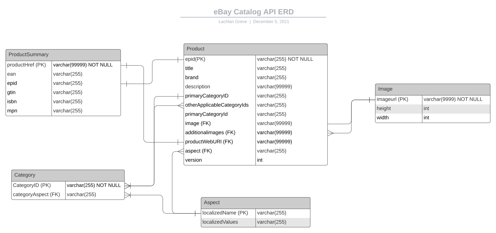
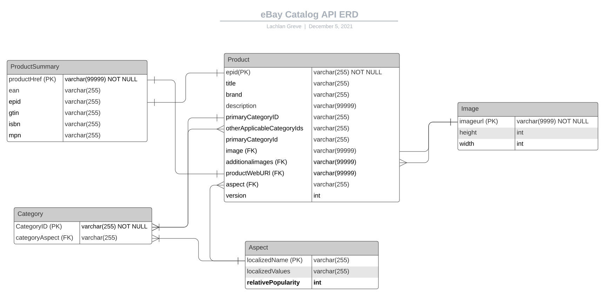

# Written Report/Proposal: Research and Improve an Application Stack 

--- 
```
* Provide an Application Stack Diagram for one product or service of the application you are considering.
```


Figure 1: *Application Stack Diagram for eBay - Matching Inventory Products to Catalog*

---
CMP1042-2.1
---
```
* Mark down which technologies fall into:
  * The Presentation Layer of the stack
  * The Application Layer of the stack
  * The Data Access Layer of the stack
```

In order to prioritize latency and scalability of their platform the eBay application stack utilizes Java for the backend and Javascript for the frontend. This technology stack allows eBay developers to streamline development [^1].

 **Presentation Layer:**
 
- Javascript: A client side programing language for the presentation layer that can update and change both HTML and CSS.

- Marko: Marko A open-source HTML rendering and templating engine that was designed by eBay.

**Application Layer:**

- Node.js: A Java(script) Runtime Environment (JRE), that is used to execute Javascript code server-side at the application layer.

- Apache Tomcat: A Java based webserver that uses concurrent execution threads, provides clustering and load balancing capabilities.

**Data Access Layer**

- Oracle RDS: Java based RDS databases from Oracle are used to store and process ordered transactions where reliability, consistency and availability are a priority - such as user login details and auction bid orders.

- Cassandra: Java based NoSQL distributed databases are used for processing large datasets at high speed. Data stored in these databases are accessed by time critical processes such as search queries.

- Hadoop: Java based database format for storage and processing of big data that is highly scalable, cost effective, fast and resistant to failure.


---
CMP1042-2.3
---
```
* Pick three technologies for and each
  * describe in a short paragraph its role in the stack and how it relates to its neighboring technologies.
```

1. Marko: Marko is a component of the presentation layer that can render HTML from Javascript. When a response to a client side request is received from the application layer through the node.js runtime, the received data is dynamically rendered by the Marko engine. The Marko engine takes advantage of the data streaming capabilities of node.js by rendering pages asynchronously as the data of the page is streamed to the client.  This functionality is advantageous for applications with high-scale traffic because hardware infrastructure is used more efficiently with less downtime spent waiting for partial or incomplete processes to complete. For the client this also improves user experience by providing low latency. 

2. Node.js: Is an application layer Java runtime environment that allows the use of Javascript as the development language in both the client and server side of an applications architecture - for an enterprise this improves the efficiency and performance of applications whilst reducing development and maintenance costs. Node.js provides the backbone of the eBay architecture by processing client requests and requesting the necessary resources from application and webserver architecture.  Node.js utilise single thread processing with non-blocking asynchronous operations, which enables high performance, low latency operation suitable for the eBay workload.

3. Apache Tomcat: Is a Java based webserver that creates containerized instances of web applications that can scale horizontally and operate independently. When requests for data are made from the node.js webserver (express.js) Tomcat will distribute the request across its containerized applications and create a request for the necessary data from the data access layer. Tomcat serves as an interface (known as middleware) between eBays application layer (Javascript) and data access layer (primarily Java). Because Tomcat can scale horizontally with containerized clusters, the single thread limitations of node.js can be overcome, providing a highly scalable solution that is optimised for performance.

---
CMP1042-2.2
---
```
* Pick two technologies and for each:
  * Discuss what physical hardware this technology is most likely delivered on. 
```

The eBay platform is required to serve up to 10,000 queries per second at 10ms latency. eBay have opted to utilise a private cloud solution using the OpenStack cloud platform. Vendor based cloud solutions are unappealing for organizations operating at the scale of eBay because they prefer to have full control of their technological innovation and vendor based systems pose constraints and can limit expansion.

eBays approach to hardware solutions has been that hardware must be selected specific to eBays application requirements. In a 2019 blog post Lam Dong gave insight to the type of system hardware that is utilised at eBay for ebay search systems[^2]:

- Aggregate system cooling and power supplies that have N+1 and dual redundant power supply, to maintain availability of the sever in the event of failure of power supply or cooling components.
- Duel socket Intel Skylake 6138 processors, selected for optimum cost/performance.
- 2TB SATA HD's for storage of optimised, distributed datasets configured in RAID 10 for performance and availability. 
- 10Gb/s optical fibre network adaptors for each node
- 128 GB ram
- 1U blade server form factor

Because the eBay technology architecture is designed to be highly scalable, partitioned and asynchronous it is likely that the same hardware could be utilised to serve all components of the eBay technology by segmenting and partitioning hardware and allocating resources where they are required.

---
CMP1042-5.3
---
```
  * Include a table comparing its features and benefits to similar alternative technologies. 
```
| Java Web Server | Source Code       | Size  | Ram Use | Dynamic Configuration | App Deployment |
| --------------- | ----------------- | ----- | ------- | --------------------- | -------------- |
| Apache Tomcat   | Open Source       | 21 mb | 103 mb  | Bad                   | 4 sec          |
| IBM WAS Liberty | Proprietary (IBM) | 65 mb | 143 mb  | Excellent             | 1.7 sec        |

The Java Web server that eBay uses is Apache Tomcat. Tomcat claims provide for more than 60% of all Java application web deployments. eBay has the architectural requirements of a webserver that can run many threaded instances of eBay whilst being; fast, small and reliable.

In 2013 Roman Kharkovski benchmarked the performance of different Java based web servers[^3]. Comparing the results from above the IBM Webshphere Application Server appears to provide competitive performance in comparison to Apache Tomcat. IBM WAS is able to deploy applications instances faster (1.7 sec v 4 sec) and also has better dynamic configuration capabilities (i.e changes to the development environment do not require server restarts).

However in terms of resource consumption Tomcat was superior with 103 mb ram and 21 mb disk space utilisation compared to 143 mb ram and 65 mb disk space for the IBM solution.

Another important consideration is that Apache Tomcat is free and open source software, whereas IMB WAS is proprietary and requires a license to use. It is likely eBay prefer to utilise Apache Tomcat because being open source allows them to make modifications to optimise the performance of the software for their use case.


| Model View Controller | Size      | Async | Popularity | Performance  | JS Modules |
| --------------------- | --------- | ----- | ---------- | ------------ | ---------- |
| Marko                 | 29.22 kb  | Yes   | Low        | 199,304 op/s | No         |
| React                 | 129.83 kb | No    | High       | 3,621 op/s   | Yes        |

Although there are many javascript model view controllers options available, eBay specifically developed Marko for their use case to address scalability and latency. eBay use Marko to render streams of HTML at the presentation layer in real time. One of the most commonly used front-end frameworks is React.js. In comparison between Marko and React[^4] [^5]:

- React requires the use of XML syntax, where as Marko uses a HTML-JS syntax, which is more familiar to HTML web developers.
- Marko is significantly smaller at 29kb compared to 129kb for React - which allows for greater performance and faster loading of web pages.
- Marko was specifically designed to operate in conjunction with Node.js to utilise its HTML data streaming capabilities to preform asynchronous rendering of webpages, React.js was not.
- One performance benchmark indicated that Marko was up to 98% faster than React at loading ui components.
- React has a larger public following and has a package manager to allow import of javascript modules, whilst Marko does not.

Marko was specifically designed by eBay for eBays requirements and offers much greater performance than alternative Javascript front-end frameworks. However, the eBay use case is relatively niche and for most developers the performance of the model view controller is not a priority.

---
CMP1042-3.2
---
```
* Examine the application’s developer API and:
   * Describe TWO processes for the input and output of data based on the company's API and how they achieve organisational objectives.
```

**eBay API's**

The eBay developer API are all RESTful. RESTful API's allow a developers program to communicate directly with the service providers technology stack using standardised HTTP methods (GET, POST, PUT and, DELETE) that provide full Create, Retrieve, Update and Delete (CRUD) capabilities. [^6] 

eBay provide separate developer API's for user features such as: Sell API, Buy API, Commerce API and Analytics API. The following two processes are facilitated through eBays Sell API:

**1. Matching inventory to catalog products**

For sellers wanting to list items for sale, eBay provide a catalog of item listings templates for various categories of different products. The eBay product catalog allows sellers to quickly create or revise product sale listings based on the templates that eBay provide.

Each product in the catalog is uniquely identified by an eBay product ID (ePID). Alternatively, many products can be identified by common industry standard product identifiers such as UPC, EAN, ISBN or brand / manufacture part number(s) (MPN).

For each item that can be found in the eBay catalog the following fields can be returned [^7]:

- Product title
- Product identifier(s)
- Product aspects (aka "item specifics")
- Stock photo(s) (not available for every catalog product)
- Product Category (incl. required category specific product aspects e.g. brand, operating system, color, storage capacity.)

The process of matching sellers inventory to catalog products achieves organisational objectives by automating the processes of listing items for sale.  Sellers who automate the listing of their products by matching inventory to catalog products reduce the amount of manual data entry needed and create more consistent and reliable listings which increases the overall efficiency of the platform. By aligning their products with pre-existing templates sellers are more likely to use common terminology to describe their products - for example: a 'red' mobile phone could also be listed as 'scarlet', 'crimson' or 'ruby' in appearance, the eBay product catalog assists sellers in selecting the appropriate color description for their product which in turn helps connect more buyers with the products that they are looking for.

**2. Marketing Seller Inventory**

eBay assist sellers in marketing their inventory by providing the Negotiation and Marketing API's[^8].

The Negotiation API allows sellers to discover buyers who are interested in their products (such as those that have have added the sellers products to their Watch list or shopping card).

The Marketing API allows sellers to attract buyers to their items by creating Promoted Listings ad campaigns and discount promotion with the Promotions Manager

To market products using eBay API's sellers create ad campaigns. Ad campaigns can be created using either: 

- Rules-based ads: groups of listings that are promoted based on selected values such as brands, category ID's or; 
- Key-based ads: specific listings to included in the campaign identified by either the listing_id or  inventory reference ID.

Each ad campaign has an associated funding model which determines the fee the seller must pay to have their listing promoted on the site. This is determined by a `bidPercentage` (0-100%) value set by the seller, a higher bid percentage specified for an ad, the more likely eBay will be to list the item for sale.

A call to the `createCampaign` method in the Marketing API includes the following fields:

- `marketplaceID` - The eBay markplace where the campaign runs (e.g US, AU, GB)
- `campaignName` - The seller defined name of the campaign 
- `fundingStrategy` - the rate at which advertised listings and promoted to potential buyers
- `startDate` - The day when the campaign begins (endDate is optional)

The ability to further market seller inventory is provided by the Recommendation API, A call to the `promoteWithAd` method responds with recommendations for which items out of a sellers listings are likely to benefit from promotion via an ad campaign as well as suggest an appropriate `fundingStategy`.

Finally, the API also provides reporting capabilities to allow a seller to create the following types of reports: 

- Account performance report
- Campaign performance summary report
- Campaing performance report
- Listing performance report
- Inventory perfomrance report

The processing of marketing seller inventory achieves organizational objectives by assisting sellers to use the platform more effectively and increasing the amount of money they make. In turn this improves users satisfaction making them more likely to continue using eBay in the future. Additionally, by facilitating paid advertisement campaigns eBay will generate additional revenue both by facilitating more sales but also revenue from the seller to promote their items.

---
CMP1042-5.1
---
```
* Describe the functions of the API that facilitate your chosen feature or service
```

The following processes are derived specifically from the eBay service of *matching seller inventory to catalog products*. [^9]

To find candidate catalog products for items the `Catalog API` is used. A GET call to the method  **search** accepts the following parameters:

- `q` : keywords from product title, description or brand
- `gtin` : Global Trade Item Number, a unique internationally identifier for a product. GTIN values can include EAN, ISBN and UPC identifier formats.
- `mpn`: Manufacturer Part Number, part number to identify products 
- `limit` : limits the number of search results that are returned. 

An example syntax to query the catalog for "iphone" and limiting the number of returned results to one is as follows:

```http
GET https://api.ebay.com/commerce/catalog/v1_beta/product_summary/search?
q=iphone&
limit=1
```

The response to this call will be a list of `ProductSummary` items that match the queried term. Each `ProductSummary` entry is identified by a `productHref` which links all of the other properties that are used identify a product (e.g. the gtin and mpn's). The most important of these values is the `epid` value - the eBay product ID that uniquely identifies that product in eBay's product catalog.

Once the correct `epid` value has been identified a GET call can then be made to the **getProduct** method. The **getProduct** method retrieves all available details about the product that matches the provided `epid`.

The syntax make a call **getProduct** call for a specific `epid` is as follows:

```http
GET https://api.ebay.com/commerce/catalog/v1_beta/product/{epid}
```

The response includes a variety of details that describe the product and can be used to automatically populate a new product listing. The returned values include: 

- `tile`: The full name of the product
- `brand`: The brand of the product
- `description`: A description of the product
- `primaryCategoryID`: The primary category that the product should be listed under
- `otherApplicableCategoryIds`: Additional and alternative categories that may apply to the product
- `image`: A link to stock images of the product
- `additionalimages`: A link to additional or alternative images of the product 
- `productURI`: a relational link to the product summary, which contains common product identifiers described above
- `version`: the version of this catalog entry for this product
- `aspect`: inherited values that are specific to the product, model or category

Aspects are an important component to the product catalog that describe features of products that are unique to product or category. Aspects can be inherited both from the category as well as aspects that are unique to that product. For example: for a mobile phone - aspects such as "3G data compatible" and "screen size" may be inherited from the category, whilst product specific aspects may include details such as "model name" or "colour".

From here the seller can select the listing template from the product catalog, make any necessary modifications and proceed to use other developer tools such as the Inventory API to create an inventory item record based on the product before offering that item for sale on eBay.

---
CMP1042-3-1, PRG1048-1.1
---

```
* Create an entity relationship diagram to depict the database tables that you believe are likely to be employed by the system you are investigating in order to provide your chosen service or product. You are free to speculate on the properties of entities and the relationships between entities.
```



Figure 2: Entity Relationship Diagram for eBay's Catalog API
```
* Supplementary to this diagram, suggest a way in which these entities might be altered in order to add an extra piece of functionality to the product or service. Explain how you think this would improve the service.
  * Explain what technologies or app functionality would need to be added to support this. Would this be difficult or expensive to implement?
  * Create a modified entity relationship diagram that depicts your planned change.
```
---
CMP1042-5.2
---

An additional functionality that would be beneficial for sellers using eBay's Catalog API would be to be able to quickly identify the popularity of a product within the parameters of the search query.

For example if a seller was to search the catalog for "iphone 11", it would be helpful to display information about how popular different colors and capacity sizes are based on previous listings. This would help to inform the seller about what inventory they should stock and assist in meeting demand for popular products.

This functionality could be implemented in many different ways and likely already has in one way or another across the 40+ API's that eBay provide. One way that it could be integrated into the existing functionality of the Catalog API could be to add an additional field, `relativePopularity` to the aspect table.

By referencing the popularity relative to specific inherited aspects and utilizing a relative scale such as 1-100 this would enable human interpretation of the data, without the need for additional processing or comparison.

For example if you were to view the product catalog for "Black Iphone 11 32GB" and further queried the "capacity" aspect of this product, the `relativePopularity` value would display an int value from 0-100 that represents how popular (i.e how many listings have been sold over a specific period of time) that the particular variety of capacity is compared to other possible configurations that the phone could be sold in.

Because this data is not time critical and is unlikely to change dramatically overtime for a certain product, this functionality could be implemented using offline batch processing of all possible permutations across the entire eBay database and periodically update values at regular intervals (say on a a daily basis). However, given the size and scale of the eBay database this would likely be a relatively costly and difficult process.

A more feasible process would be to implement this functionality through an additional API call - This could calculate the `relativePopularity` values on a as needed basis. The benefits of this approach is that the data would be more recent and because as not all users are likely to want or use the added functionality from the `relativePopularity` field, unnecessary computational resources are avoided.

---
PRG1048-1.2
---


Figure 3: Entity Relationship Diagram for eBay's Catalog API +relativePopularity

Bibliography
---

[^1]: ebay - ebay Tech Stack. StackShare. (2021). Retrieved 28 November 2021, from https://stackshare.io/ebay/ebay.

[^2]: Dong, L. (2021). eBay's Hyperscale Platforms. Tech.ebayinc.com. Retrieved 5 December 2021, from https://tech.ebayinc.com/engineering/odm/.

[^3]: Kharkovski, R. (2021). Lightweight Java servers and developer view on the App Server (update). Why WebSphere Blog. Retrieved 5 December 2021, from https://webspherecompetition.wordpress.com/2015/09/22/lightweight-java-servers-and-developer-view-on-the-app-server-update/.

[^4]: Marko vs React: An In-depth Look | Marko. Markojs.com. (2021). Retrieved 5 December 2021, from https://markojs.com/docs/marko-vs-react/.

[^5]: GitHub - marko-js/templating-benchmarks: Benchmarking framework for multiple templating engines. GitHub. (2021). Retrieved 5 December 2021, from https://github.com/marko-js/templating-benchmarks.

[^6]: Developer.ebay.com. (2021). Retrieved 5 December 2021, from https://developer.ebay.com/api-docs/static/ebay-rest-landing.html. 

[^7]: Developer.ebay.com. (2021). Retrieved 5 December 2021, from https://developer.ebay.com/api-docs/sell/static/inventory/matching-products.html.

[^8]: Developer.ebay.com. (2021). Retrieved 5 December 2021, from https://developer.ebay.com/api-docs/sell/static/marketing/marketing-seller-inventory.html.

[^9]: Developer.ebay.com. (2021). Retrieved 5 December 2021, from https://developer.ebay.com/api-docs/commerce/catalog/overview.html.